<div align="center">
  
<h1> ЦГВ: Проекты </h1>


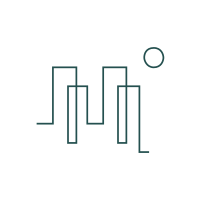

Мобильное приложение для Центра городских волонтеров Санкт-Петербурга.

</div>

---

<div align="center">
  <samp>
    <table>
      <tr>
        <td align="center">
          <br />
          <p>⚡ <b>Внимание: проект находится в <i>очень</i> ранней стадии разработки!</b> ⚡</p>
          <p>
            (Едва-едва собрали MVP...)
            <br><br>
            Новые задачи создаются ежедневно, кодовая база видоизменяется.
            <br>
            Многие функции будут переработаны, а код трижды переписан.
            <br><br>
            Не судите строго :<
          </p>
          <br />
        </td>
      </tr>
    </table>
  </samp>
</div>

<br>

## О проекте

Данное мобильное приложение предназначено для координации волонтёрской деятельности отдельных объединений(городов).

<br>

Основная цель этого проекта - попытаться сократить количество бумажной работы координаторов, поскольку она сильно замедляет и усложняет и без того непростой цикл проведения.

<br><br>

На данный момент приложение позволяет:
* Координаторам: создавать свои мероприятия, просматривать и вносить вердикт по заявкам, отслеживать статистику и генерировать отчётность(.pdf файлом) по проведённым мероприятиям.
* Пользователям: просматривать каталог и записываться на мероприятия, участвовать в глобальном рейтинге, просматривать свою статистику и работать со встроенным календарём.
* Администратору: создавать аккаунты координаторов/пользователей, удалять и создавать различные объекты платформы(локации, обложки, теги и т.д.)

<br>

> [!NOTE]
> Пока что функционал очень ограничен, но мы активно работаем над развитием платформы!
>
> **Если у вас есть какие-либо идеи - смело создавайте [предложение по доработке](../../issues/new/choose)!**
>
> **Будем рады любой обратной связи! Спасибо!! ^w^**

---

## Скриншоты / Демо

<br>

### Общее

<br>

<table>
    <tr>
        <td>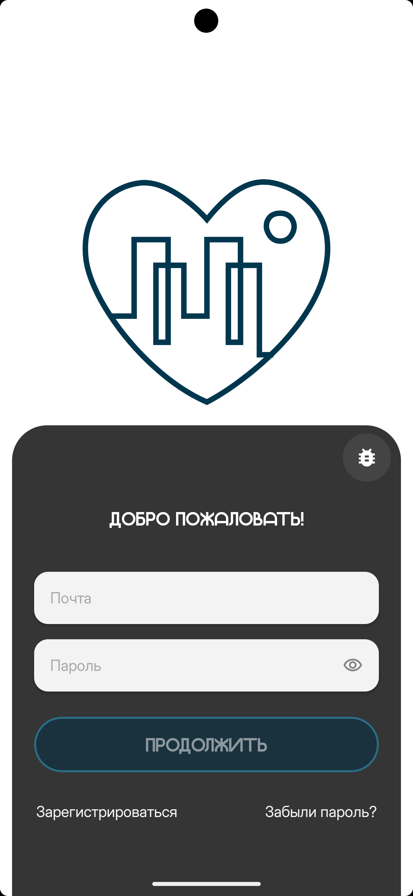</td>
        <td>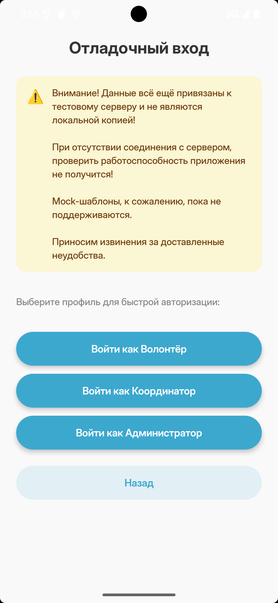</td>
        <td>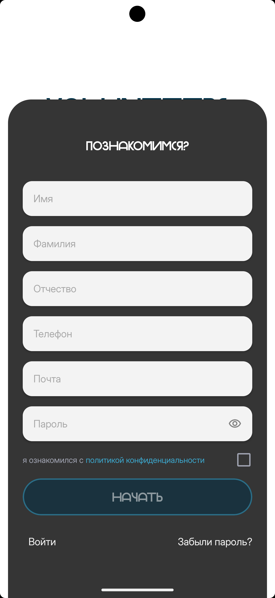</td>
    </tr>
</table>

---

### Волонтёр

<table>
    <tr>
        <td>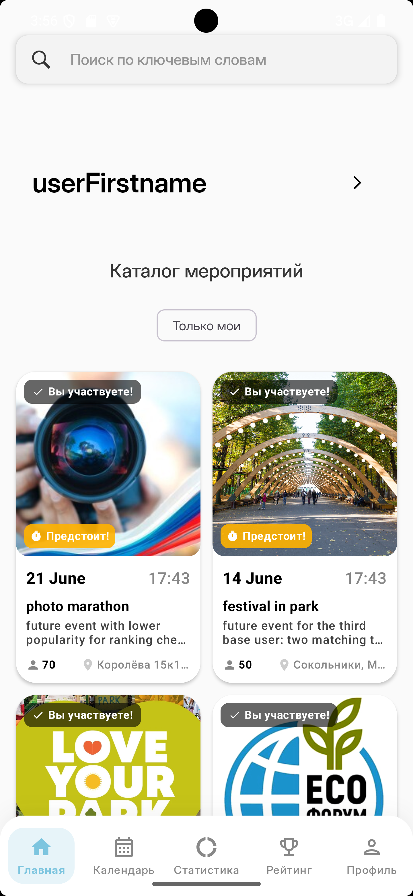</td>
        <td>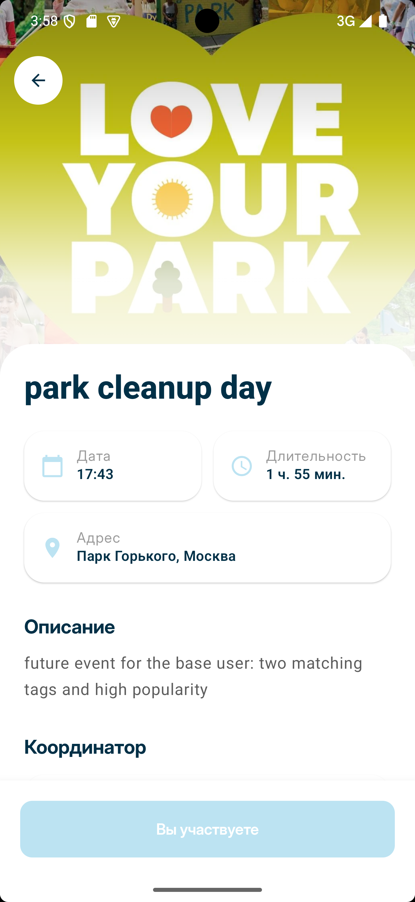</td>
        <td>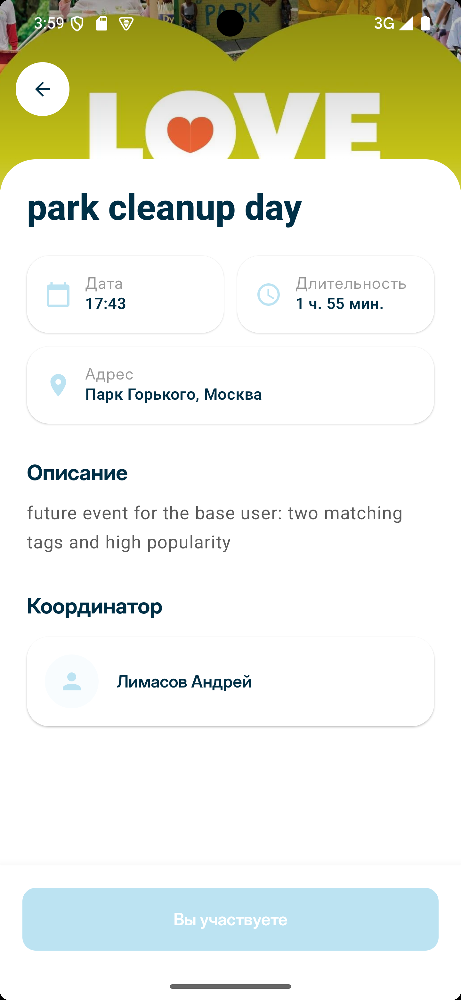</td>
    </tr>
    <tr>
        <td>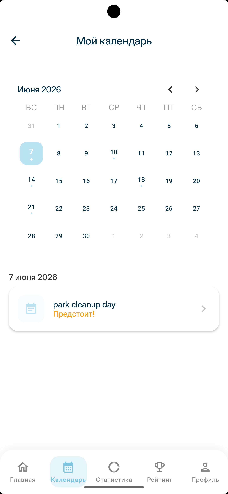</td>
        <td>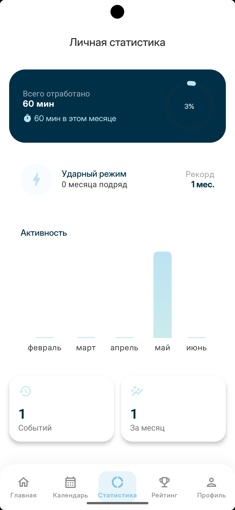</td>
        <td>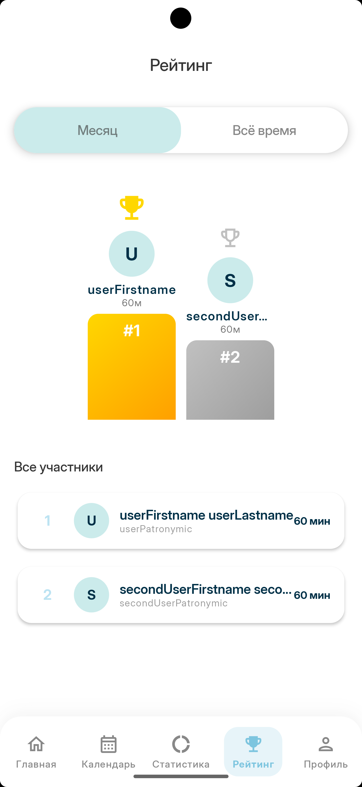</td>
    </tr>
    <tr>
        <td>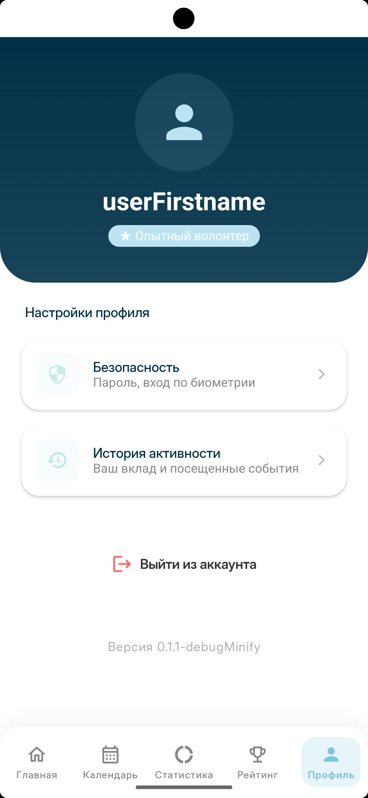</td>
    </tr>
</table>

---

### Координатор

<table>
    <tr>
        <td>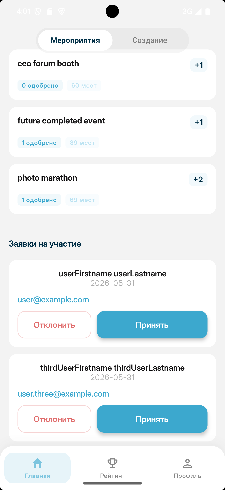</td>
        <td>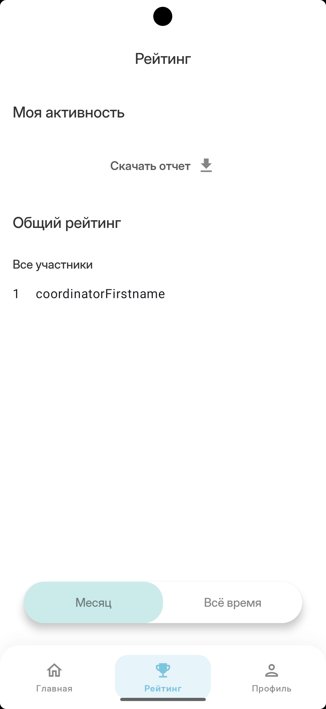</td>
        <td>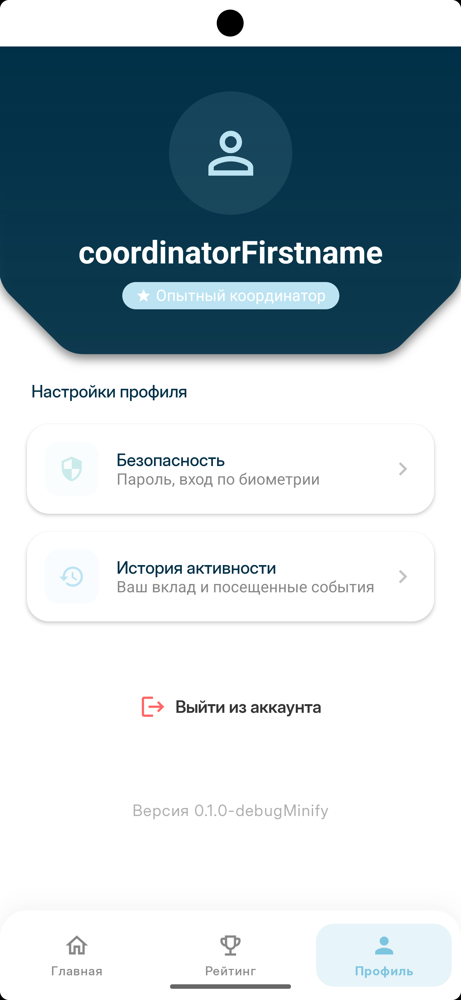</td>
    </tr>
</table>

---

### Администратор

<table>
    <tr>
        <td>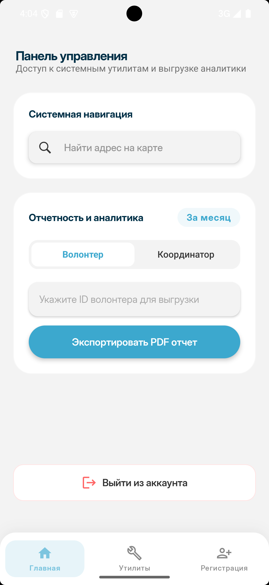</td>
        <td>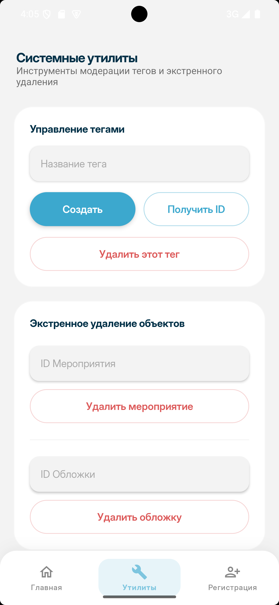</td>
        <td>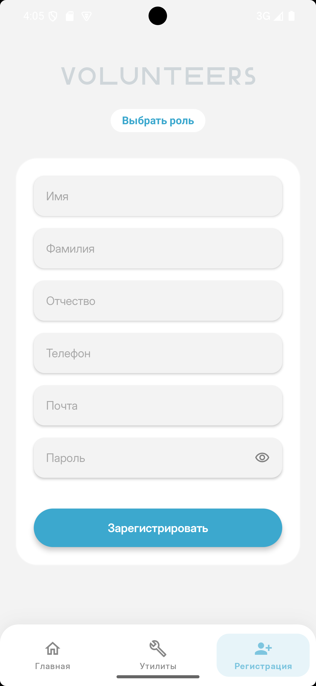</td>
    </tr>
</table>

---

### Демо (Запись)

[Посмотреть запись!](assets/demo/demo.mp4)

---

## Структура модулей

```text
presentation/   Экраны, ViewModel, навигация, темы и компоненты UI
domain/         Бизнес-логика и интерфейсы репозиториев
data/           Работа с сетью, дата-репозитории, модели API
core/           Основные сущности, аннотации, тестовые фикстуры
storage/        Имплементация DataStore, вспомогательные android-утилиты
```

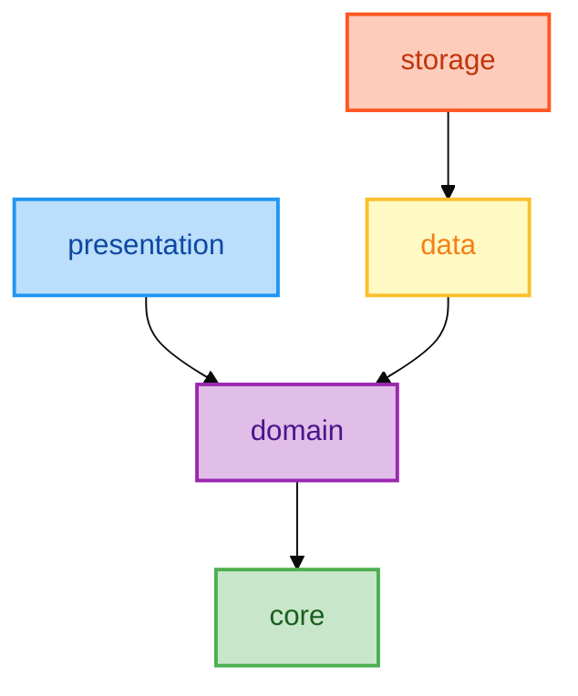

---

# Установка демо-версии
> [!CAUTION]
> **Отладочная демо-версия всё ещё привязана к нашей серверной части!!**
> 
> **Если вдруг сервер навернётся, грохнется, исчезнет и т.д., дальше экрана входа не попасть!**
> 
> В будущем, конечно, классно было бы поднимать локальную БД под такие дела, но пока так.
> 
> **P.S. Доступ к админке есть у кто-угодно, так что как пользователь, так и мероприятия с локациями и тегами могут видоизменяться, а БД периодически сбрасываться.**
>
> **Пожалуйста, будьте аккуратны :<**

> [!WARNING]
> Приложение работает только с версиями Android 10 и выше!
> 
> Пожалуйста, проверьте вашу версию Android перед установкой!

> [!NOTE]  
> Если вы нашли баг в демо-версии или у вас не запускается приложение, пожалуйста, [создайте Issue](../../issues/new/choose), прикрепив модель устройства и установленную OC.

1. Перейдите на страницу [Releases](../../releases/latest)
2. Нажмите на последнюю версию с тегом `Latest`
3. В блоке **Assets** скачайте .apk файл с постфиксом ```-debugMinify```.
4. Запустите скачанный файл! ^w^

# Сборка

## Требования

<br>

- Android Studio с поддержкой Kotlin 2.2+
- JDK 21
- Gradle (версия управляется wrapper)

```bash
./gradlew assembleDebug
```

> [!WARNING]
> Для подписи ```release``` варианта, необходимы переменные окружения:
> - `ANDROID_KEYSTORE_PATH`
> - `ANDROID_KEYSTORE_PASSWORD`
> - `ANDROID_KEY_ALIAS`
> - `ANDROID_KEY_PASSWORD`

Вариант ```releaseNoSign``` позволяет выполнить сборку release соурс-сета с отладочной подписью(без необходимости подтягивать кейстор).

Вариант ```debugMinify``` позволяет собрать отладочный apk с активным R8(оптимизация и обфускация кода, сжатие ресурсов).

> [!IMPORTANT]
> UI-инструменты отладки доступны только при сборке в ```debug``` или ```debugMinify``` варианты!
>
> Имеются в виду инструменты, которые специально включены в приложение для упрощения отладки. Например, быстрый вход для разработчиков.

---

## Документация

<b>Затерялась в бэклоге... :<</b>
<br>
<i>(В разработке!)</i>

---

## Котик!
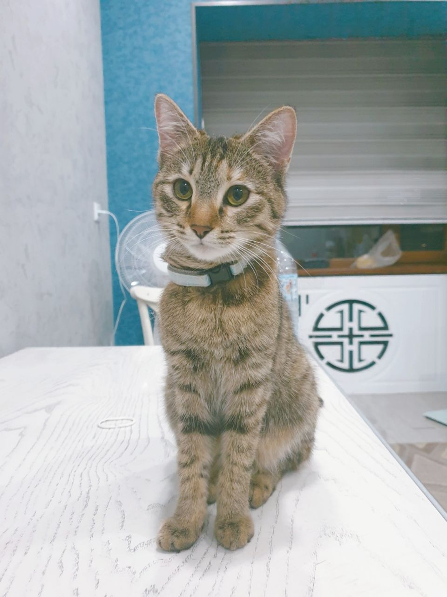

---

## Авторство

<br>

Разработка ведётся в рамках кейс-задания учениками ГБНОУ «Академия Технического Творчества и Цифровых Технологий»! ^w^


## Лицензия

См. файл [LICENSE](./LICENSE).
